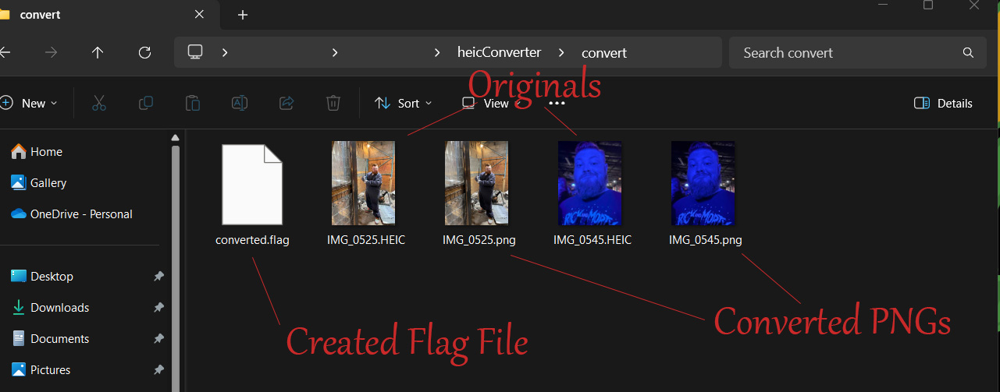

# CITRUS PHOTO CONVERTER


Are you struggling with incompatible HEIC image files cluttering your storage or causing issues on some platforms? Look no further than HEIC to PNG, your one-stop solution for converting HEIC images to the universally-recognized PNG format!

This Python script, playfully named Citrus offers a simple and efficient way to convert all your apple HEIC images within a designated folder. It even includes an optional flag file to prevent redundant conversions, ensuring your precious storage space stays optimized.

This README will guide you through the installation process, explain how to use the script, and provide details about its functionalities. Let's dive in and convert those HEICs to PNGs with ease!

### Turning Apples into Oranges!

---

## Installation

- Clone the Repo here:
  [Repo Link](git@github.com:8BitGinger/citrus.git)

_then_

- Navigate to the folder and type the following:

```
pip install -r requirements.txt
```

_next_

- add any heic photos you wish to see converted to the folder labeled:

**_convert_**

_then_

- Type the following command:

```
python citrus.py
```

- All files with the extension of .heic or .HEIC will be converted to png format under the same name.

_before running again!_

- Remove all unnecessary files _(originals already converted and the newly created pngs)_ and delete the Converted Flag File.

_**That's it! You've turned your Apple Photos into Delicous Oranges(PNGS)**_

---

## Screenshots



---

## Links

[HTML Landing Page](https://8bitginger.github.io/citrus/)

[Repo Link](git@github.com:8BitGinger/citrus.git)

---

## Contact

[Gmail](mailto:ryan.fann@gmail.com)

[GitHub](https://github.com/8BitGinger)

[Dev Portfolio](https://ryanfann.netlify.app/)
